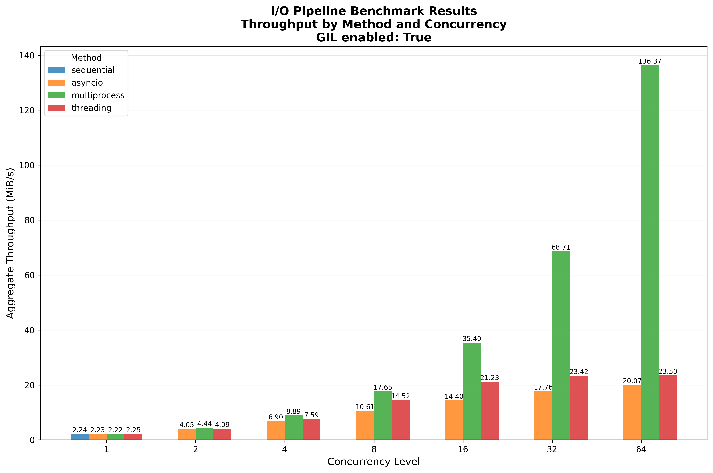
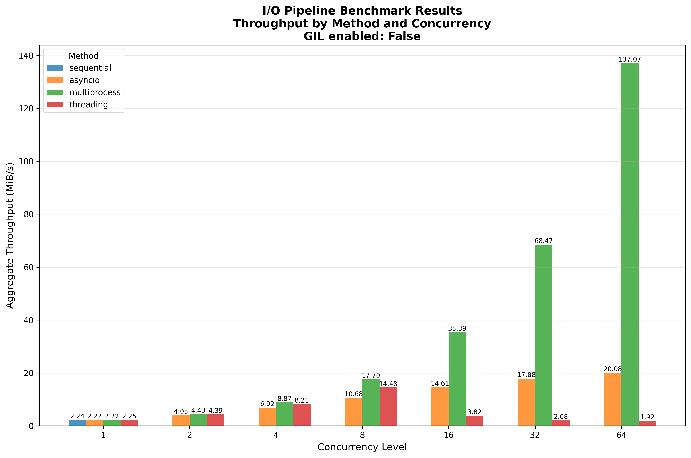

These results were collected on the ALCF Polaris system.  Tests were executed on a compute node using the local scratch NVMe drives.

* Python 3.14 (compiled from source with the GIL disabled)

The data files here reflect running the benchmark both with and without the GIL enabled in the Python interpreter; see the following plots drawn using the `io-pipeline-bench-plotter.py` script:

## Results with GIL Enabled

## Results with GIL Disabled

# Discussion

The threading version performs considerably better in the configuration with the GIL disabled, but it still does note remotely approach the performance of the multiprocess version.