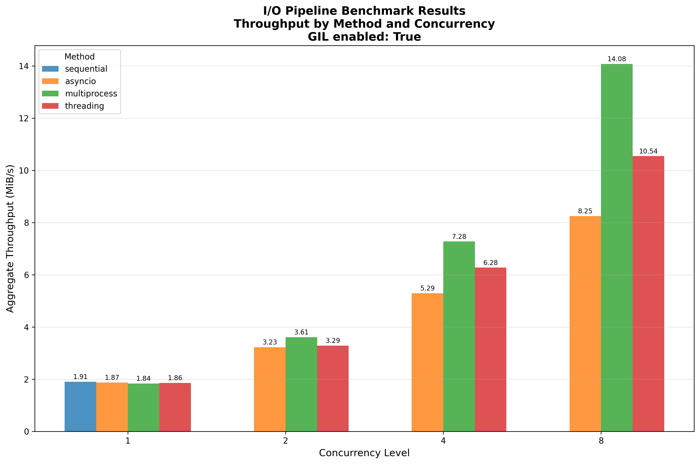
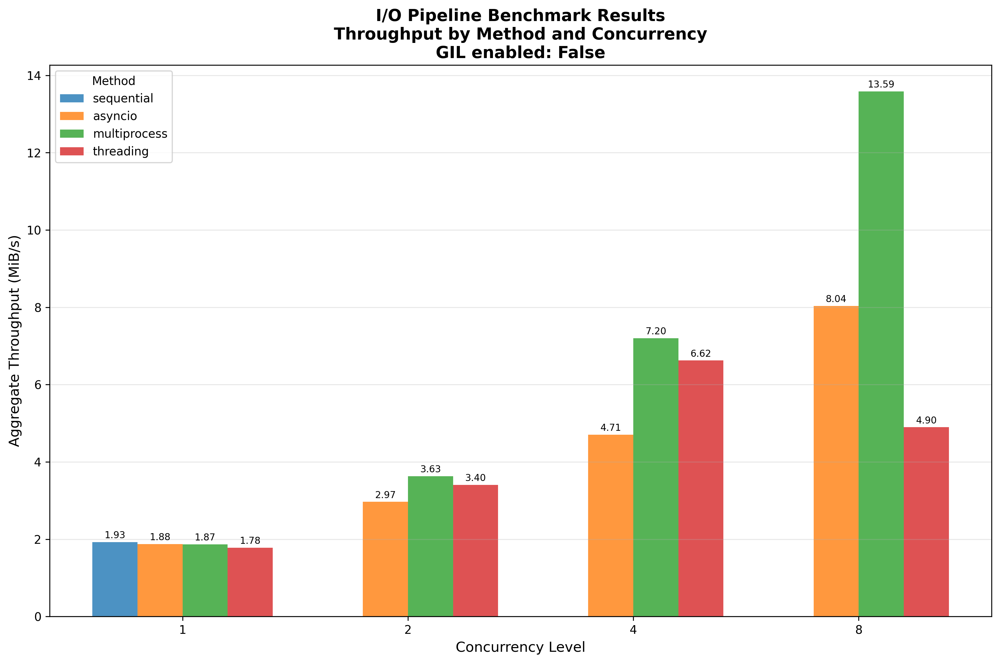
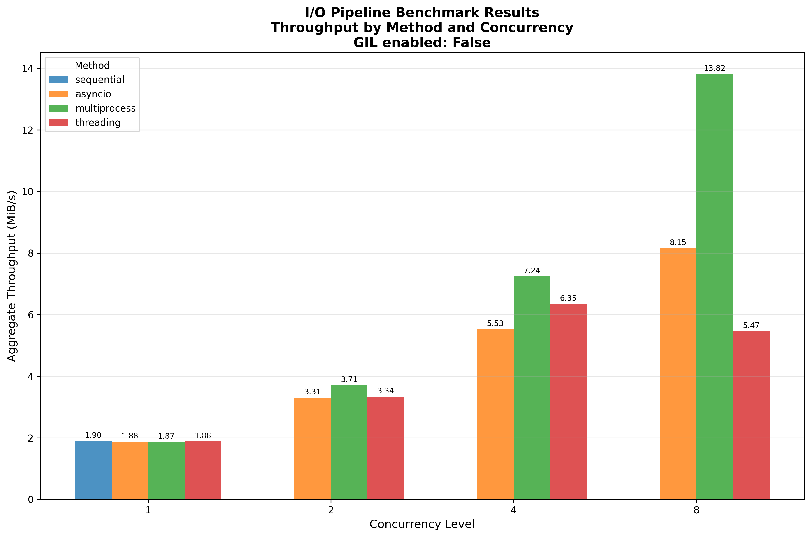

These results were collected on a Thinkpad X1 laptop with the following specifications:

* Ubuntu 25.04
* Python 3.14 (compiled from source with the GIL disabled)
* 32 GiB of RAM
* 512 GiB Sandisk SN810 NVMe drive
* Intel i7-1365U processor (12 CPU threads)

The data files here reflect running the benchmark both with and without the GIL enabled in the Python interpreter; see the following plots drawn using the `io-pipeline-bench-plotter.py` script:

## Results with GIL Enabled

## Results with GIL Disabled

## Results with GIL Disabled (second run to confirm results)

# Discussion

The *multiprocess* method is consistently the fastest in all tests.  Counterintuitively, the *threading* model performance declines when the GIL is disabled.  The expectation was that it would approach the performance of the *multiprocess* method when the GIL was disabled.  It actually performs worse with 8x concurrency than with 4x concurrency.  This requires some investigation.

This is likely a system-specific phenomena, because we don't see threading performance collaps in the [Polaris results](../polaris-2025-10-21/README.md).